# AIRI Equipment & Reservation User Manual

This guide provides step-by-step instructions on how to add new equipment to the inventory system and how to manage user reservations.

---

## 1. Initial Inventory Setup (Snipe-IT)
Before a physical piece of equipment can appear on the website, it must be properly defined in the Snipe-IT inventory system. Snipe-IT uses a logical structure, meaning you first need to define the "type" of item before adding the actual physical device.

### Step 1.1: Creating a Category
First, we define the general category of the equipment (e.g., Laptops, Monitors).
1. Go to the left menu and click on the gear icon for **Settings**, then select **Categories**.

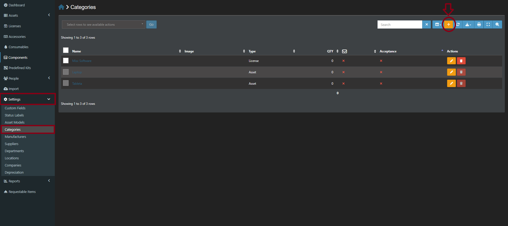

2. Click the **Create New** button.
3. Enter the **Name** of the category.
4. **Important:** Click on the **Type** dropdown and select **Asset**. You can leave all other fields blank. Click **Save**.

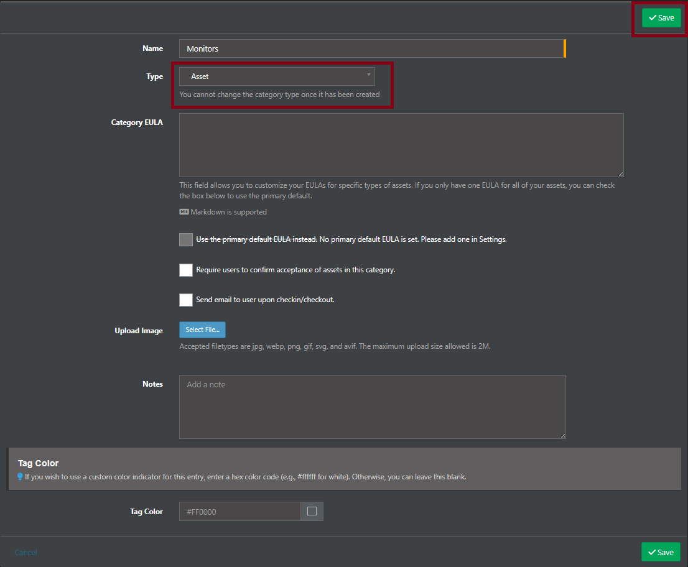

### Step 1.2: Creating or Selecting a Manufacturer
Next, we define the brand or creator of the equipment (e.g., Dell, Apple, Lenovo). The system may already have several common manufacturers pre-configured by default.

1. Go to **Settings -> Manufacturers**. Here you will see a list of all currently available manufacturers in the system.

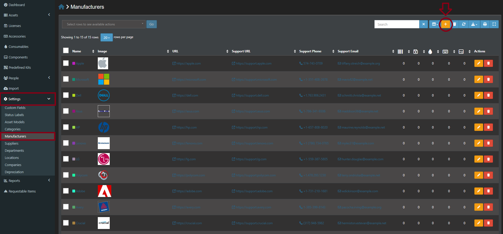

2. If the manufacturer you need is not already on the list, click the **+ (Create New)** button in the top right corner.
3. Enter the **Name** of the manufacturer 
4. *(Optional)* You can also fill in additional details, such as the Support URL, Support Phone, or Support Email. These are useful for future maintenance or warranty claims, but they are not mandatory. 
5. Click **Save**.

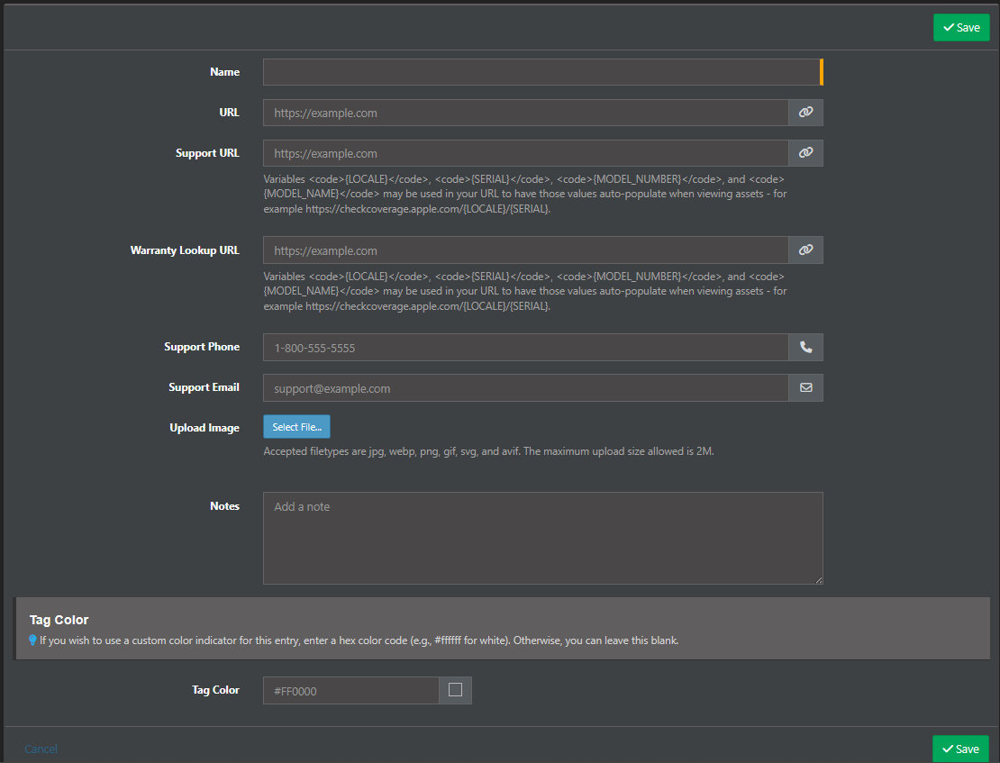

### Step 1.3: Adding the Equipment (Asset & Model)
Now, we add the actual physical equipment and define its model in one single step. 

1. In the left menu, go to **Assets**.

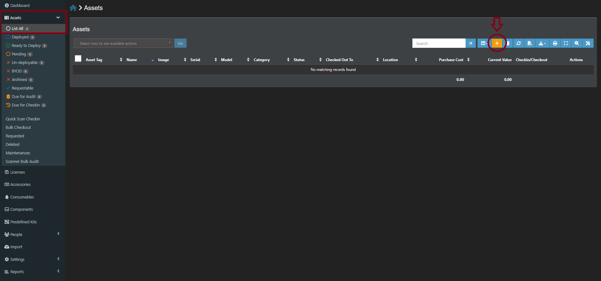

2. Click on the **Create New** button.

3. At the very beginning of the form, fill in the **Asset Tag**. This is the unique ID for your equipment (e.g., LAP-001). 

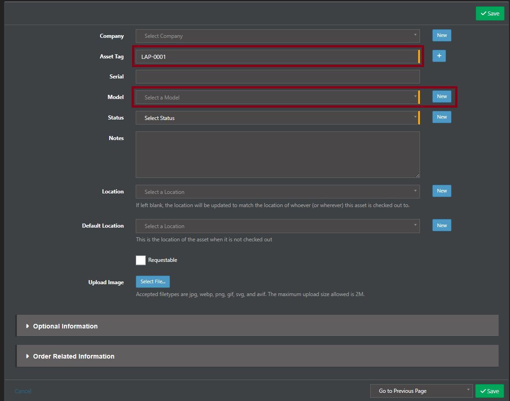

4. Next, set up the model. Fill in the **Model Name**, and select the **Manufacturer** and **Category** you created earlier from the dropdown menus. 

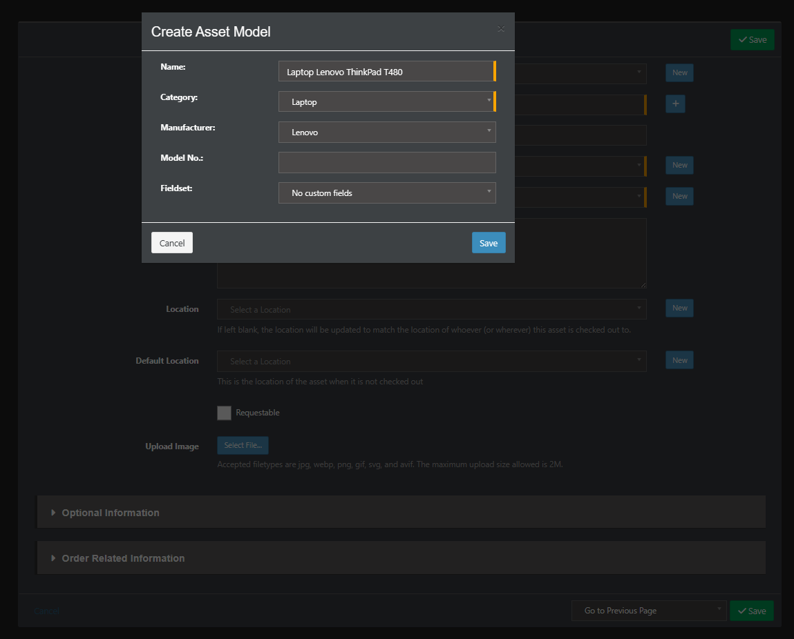

5. Scroll down to the **Status** field and select **Ready to Deploy**. *(Important: If you do not select this exact status, the item will not be visible on the website!)*

6. Click **Save** to finish adding the equipment.

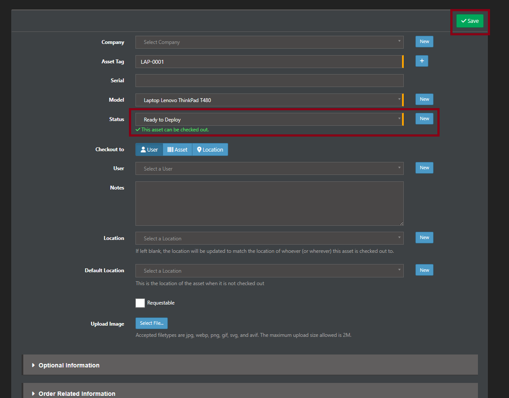

## 2. Requesting a Reservation (User Perspective)
This is what the students or researchers will do on the public website. 
1. The user navigates to the **Equipment** section on the AIRI website.
2. They will see all items currently marked as *Ready to Deploy*.

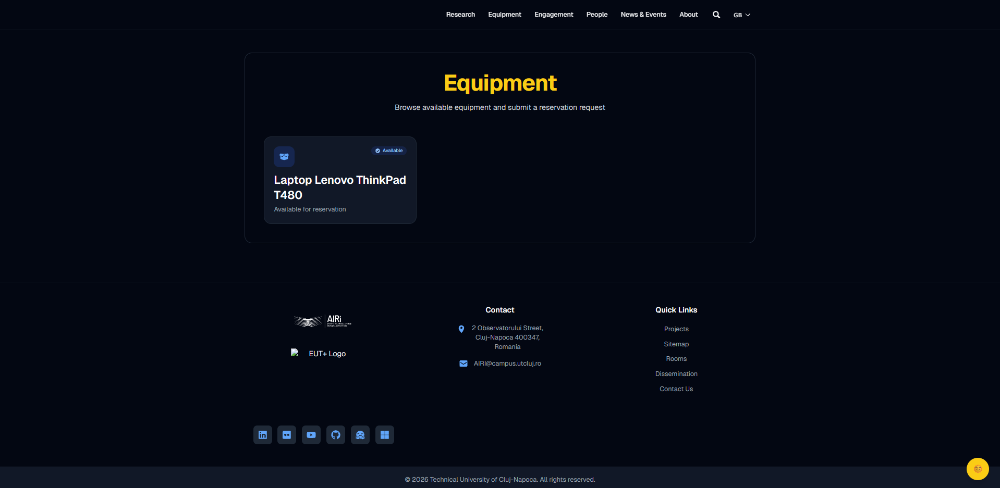

3. The user clicks on the desired equipment, fills out their details in the reservation form, and submits the request. 

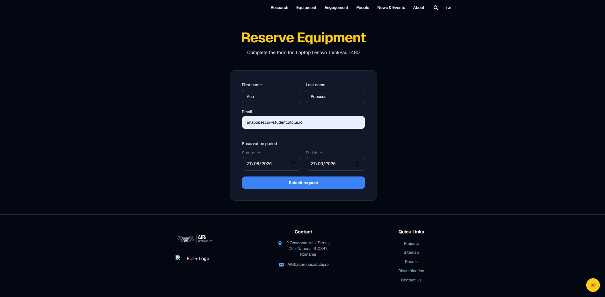

## 3. Approving a Reservation
Once a user submits a request, the laboratory administrator or secretary must approve it before handing over the physical device.

1. Log in to the **Strapi Administration Panel**.
2. Go to **Content Manager -> Reservations**.

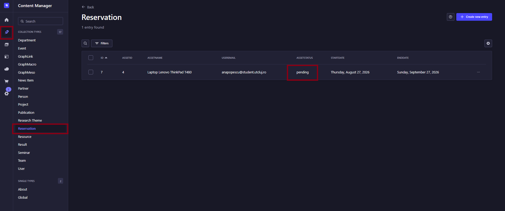

3. You will see the new requests listed with a **`pending`** status. Click on the reservation you want to manage.
4. Check the requested date for the reservation and change the **Status** accordingly:
   * **If the reservation starts TODAY:** Change the status to **`checked_out`**. *(Note: This action automatically updates the Snipe-IT inventory in the background, marking the item as checked out).*
   * **If the reservation is for a FUTURE date:** Change the status to **`approved`**. *(You will need to return to this page and change it to `checked_out` on the actual day the user comes to pick up the equipment).*
5. Click **Save**.

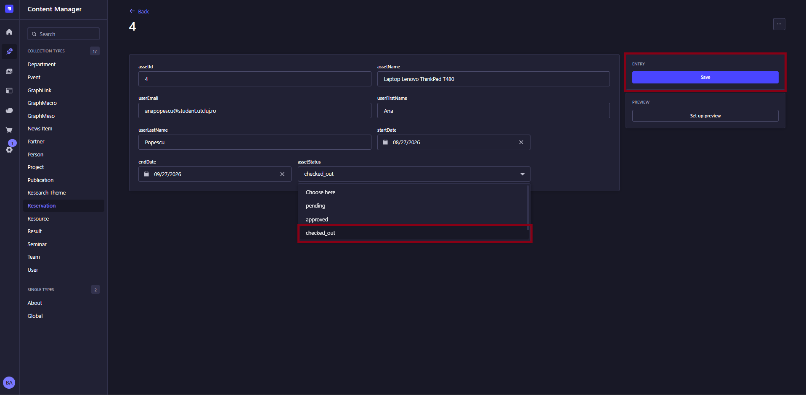

**Verifying the Checkout in Snipe-IT**
If you want to check that the synchronization worked, you can go to your Snipe-IT dashboard. You will see that the equipment's status has automatically changed to **Deployed** and it is now assigned to the user who requested it.

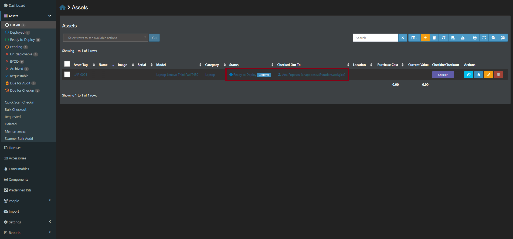

## 4. Returning Equipment (Check-in)
When the student or researcher physically brings the equipment back to the laboratory, you must record the return in the system.
1. Go back to the **Strapi Administration Panel** and open the same reservation (**Content Manager -> Reservations**).

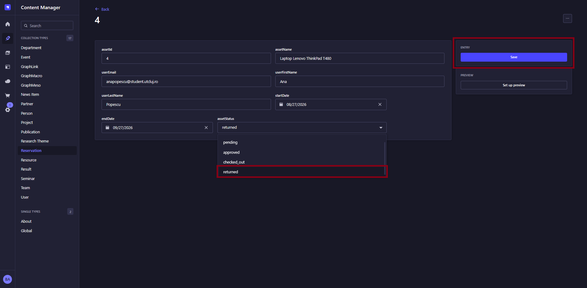

2. Change the **Status** to **`returned`** and click **Save**.
*Note: This automatically notifies Snipe-IT that the item is back. Its status will instantly switch back to "Ready to Deploy", and it will automatically reappear on the public website for other people to reserve.*

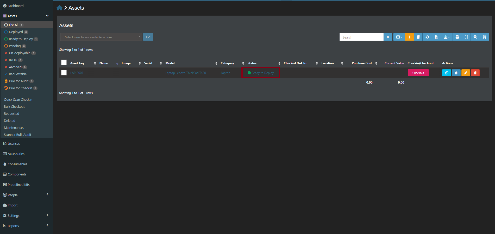

## 5. Troubleshooting & Best Practices

Here are a few common issues and tips to keep the system running smoothly:

* **Equipment is not visible on the website:** 
  Double-check the equipment's status in Snipe-IT. The website will *only* display items that have their status set exactly to **Ready to Deploy**. If it is set to "Pending" or "Archived", it will not appear.
* **Reservation dates:** 
  Always pay attention to the requested date in Strapi. Do not set a reservation to `checked_out` if the user is scheduled to pick up the item next week. Use `approved` instead.
* **Returning items early:** 
  If a user returns an item before the scheduled end date, you can safely change the status to `returned` in Strapi right away. The system will make the equipment available for others immediately.